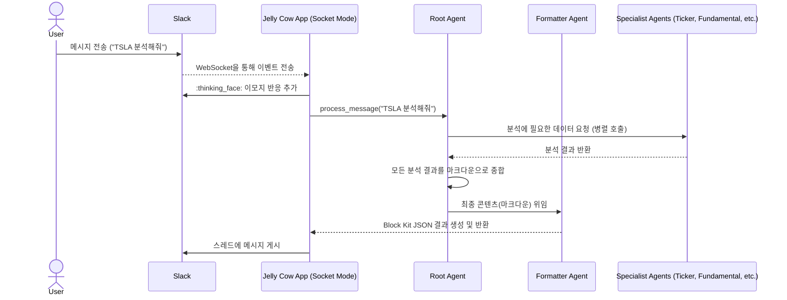

# Jelly Cow - AI 투자 분석 에이전트

Jelly Cow는 금융 자산 및 투자 포트폴리오에 대한 심층적인 분석 보고서를 제공하도록 설계된 AI 기반 투자 분석 에이전트입니다. 기본적 분석, 기술적 분석, 뉴스 분석을 수행하기 위해 전문화된 AI 에이전트로 구성된 계층적 팀을 사용하며, 종합된 보고서를 Slack을 통해 전달합니다.

## 주요 기능

- **Slack 연동 (소켓 모드)**: Slack 워크스페이스 내에서 DM이나 멘션을 통해 에이전트와 직접 상호작용하여 개별 자산 분석 또는 포트폴리오 진단을 요청할 수 있습니다. **개인 계좌 관련 기능(예: 포트폴리오 분석)은 보안상의 이유로 DM에서만 작동하며, 공개 채널에서는 제한됩니다.** 소켓 모드를 사용하여 별도의 HTTP 엔드포인트 노출 없이 안전하게 통신합니다.
- **다중 사용자 실계좌 연동 포트폴리오 분석 (DM 전용)**: 다중 사용자를 지원하며, 각 Slack 사용자는 자신만의 계좌 정보를 등록하여 포트폴리오 분석을 받을 수 있습니다. 한국투자증권 계좌와 연동하여 실제 보유 중인 자산을 기반으로 포트폴리오를 분석하고 리밸런싱 계획을 제안합니다. **이 기능은 DM에서만 사용 가능합니다.**
- **대화형 Q&A**: 에이전트가 분석 리포트에서 언급한 기술적 분석 용어(예: "RSI가 뭔가요?")나 기업 고유의 기술(예: "CUDA가 무엇에 쓰이나요?")에 대해 질문하면, 에이전트가 해당 개념을 간략하게 정의하고 분석과 어떤 관련이 있는지 설명해줍니다. 이를 통해 사용자는 분석 내용을 더 깊이 이해하고 후속 질문을 이어갈 수 있습니다.
- **계층적 에이전트 팀**: 루트 에이전트가 전문가 팀에게 작업을 위임하여 다각적인 분석을 수행합니다:
    - **기본적 분석가**: `get_current_time_string`을 호출하여 현재 시각을 파악하고, 이를 바탕으로 연간 및 최신 분기 보고서를 모두 분석하여 기업 개요, 재무 비율(PER, PBR 등), 애널리스트 추천 의견 등 펀더멘털을 평가합니다.
    - **기술적 분석가**: RSI, MACD, 볼린저 밴드 등 주요 기술 지표를 바탕으로 차트를 분석합니다.
    - **뉴스 분석가**: `get_company_news`로 최신 뉴스를 수집하고 `load_web_page`로 뉴스 내용을 분석하여 시장 심리와 주요 이슈를 파악합니다.
- **확장 가능한 아키텍처**: 새로운 분석 도구나 데이터 소스를 쉽게 추가할 수 있습니다.
- **비동기 처리**: `asyncio`와 `slack_bolt`의 비동기 핸들러를 사용하여 여러 요청을 효율적으로 처리합니다.

## 아키텍처

Jelly Cow는 사용자의 요청을 받아 여러 전문 에이전트가 협력하여 분석을 수행하고, 종합된 결과를 다시 사용자에게 전달하는 계층적 에이전트 아키텍처를 따릅니다. **소켓 모드**를 사용하여 Slack과의 통신이 이루어집니다.



위 다이어그램은 단일 자산 분석 요청의 흐름을 보여줍니다. 포트폴리오 분석의 경우, `RootAgent`는 `PortfolioAnalyzerAgent`에게 작업을 위임합니다. `PortfolioAnalyzerAgent`는 `get_current_portfolio` 도구를 사용하여 사용자의 전체 보유 자산을 가져온 다음, 각 자산에 대해 `SingleAssetAnalyzerAgent`를 호출하여 개별 분석을 수행하고 그 결과를 종합하여 최종 리밸런싱 계획을 수립합니다.

1.  **연결 수립**: `app.py`가 실행되면, `AsyncSocketModeHandler`가 Slack API에 웹소켓 연결을 생성하고 이벤트 수신을 시작합니다.
2.  **이벤트 수신**: 사용자가 Slack에서 봇에게 DM을 보내거나 채널에서 멘션하면, Slack이 이 웹소켓 연결을 통해 `message` 또는 `app_mention` 이벤트를 `JellyCowApp`으로 전송합니다.
3.  **요청 처리 및 위임**: `apis/slack.py`의 이벤트 핸들러가 이벤트를 수신합니다. 핸들러는 요청을 확인했음을 알리기 위해 원본 메시지에 `:thinking_face:` 이모지를 추가하고, 사용자의 쿼리를 `root_agent`에게 비동기적으로 전달합니다.
4.  **에이전트 오케스트레이션**: `root_agent`는 쿼리를 해석하고, `TickerLookupAgent`를 통해 티커를 확인한 후, `fundamental_analyzer`, `technical_analyzer`, `stock_news_analyzer` 등 여러 하위 전문 에이전트에게 분석을 병렬로 위임합니다.
5.  **데이터 수집 및 분석**: 각 하위 에이전트는 `yfinance`, `google_search` 등 필요한 도구를 사용하여 데이터를 수집하고 분석을 수행합니다.
6.  **결과 종합 및 최종 형식화**: `root_agent`는 하위 에이전트들로부터 받은 모든 분석 결과를 **하나의 마크다운(Markdown) 문자열로 종합**합니다. 그 후, 이 마크다운 콘텐츠를 `FormatterAgent`에게 **최종 위임(delegate)**합니다. `FormatterAgent`는 이 콘텐츠를 Slack에 표시하기 위한 최종 Block Kit JSON으로 변환하여 반환하며, 이 결과가 사용자에게 응답으로 게시됩니다. 이 과정에서 `apis/slack.py`의 핸들러는 에이전트가 유효하지 않은 JSON을 반환하더라도 가독성 있는 마크다운으로 변환해주는 최종 안전장치 역할을 합니다.

## 시작하기

### 사전 요구 사항

- Python 3.12 이상
- Slack 워크스페이스
- Google Gemini API 키
- 한국투자증권 계좌 및 API 사용 신청

### 설치

1.  **리포지토리 클론:**
    ```bash
    git clone <repository-url>
    cd jelly_cow
    ```

2.  **의존성 설치:**
    ```bash
    pip install -r requirements.txt
    ```

3.  **환경 변수 설정:**
    - `.env_template` 파일을 `.env`라는 새 파일로 복사합니다.
    - 아래 **API 키 및 토큰 발급** 섹션을 참고하여 발급받은 키 값을 `.env` 파일에 입력합니다.

4.  **사용자 프로필 설정 (포트폴리오 분석용):**
    - `profiles/` 디렉토리 안에 각 사용자를 위한 프로필 파일을 생성합니다.
    - `profiles/template.json` 파일을 복사하여 새 파일을 만듭니다.
    - 파일 이름은 **Slack 사용자 ID**로 지정해야 합니다 (예: `U12345ABC.json`).
    - 생성된 파일 안에 자신의 한국투자증권 API App Key, Secret Key 및 계좌 정보를 입력합니다.
    - Slack 사용자 ID는 Slack 프로필의 '더 보기' 버튼을 눌러 '사용자 ID 복사'를 통해 확인할 수 있습니다.

### API 키 및 토큰 발급

#### 1. Slack 봇 생성 및 토큰 발급 (소켓 모드)

1.  [Slack API](https://api.slack.com/apps) 페이지로 이동하여 **Create New App**을 클릭하고, **From scratch**를 선택합니다.
2.  앱 이름을 정하고, 앱을 추가할 워크스페이스를 선택합니다.
3.  **Socket Mode** 메뉴로 이동하여 **Enable Socket Mode**를 활성화합니다.
4.  토큰 이름을 정하고(예: `jelly-cow-app-token`), **Generate**를 클릭하여 **앱 수준 토큰(App-Level Token)**을 생성합니다. 이 토큰은 `xapp-...` 형식이며, `.env` 파일의 `SLACK_APP_TOKEN` 값이 됩니다.
5.  **Event Subscriptions** 메뉴로 이동하여 **Enable Events**를 활성화합니다.
    - **Request URL**은 소켓 모드에서 필요 없으므로 비워둡니다.
    - **Subscribe to bot events** 섹션에서 다음 이벤트를 추가합니다.
        - `app_mention`: 봇이 멘션될 때 이벤트를 수신합니다.
        - `message.im`: 봇에게 다이렉트 메시지(DM)가 올 때 이벤트를 수신합니다.
6.  **OAuth & Permissions** 메뉴로 이동하여 **Bot Token Scopes** 섹션에서 다음 권한을 추가합니다.
    - `app_mentions:read`: 봇이 멘션된 채널의 메시지를 읽습니다.
    - `chat:write`: 메시지를 보냅니다.
    - `im:history`: 봇과의 DM 기록을 읽습니다.
    - `reactions:write`: 메시지에 이모지 반응을 추가합니다.
7.  페이지 상단에서 **Install to Workspace**를 클릭하여 앱을 설치하고, **Bot User OAuth Token** (`xoxb-...` 형식)을 복사합니다. 이 값이 `.env` 파일의 `SLACK_BOT_TOKEN`이 됩니다.
8.  **Basic Information** 메뉴로 이동하여 **App Credentials** 섹션의 **Signing Secret** 값을 복사합니다. 이 값이 `.env` 파일의 `SLACK_SIGNING_SECRET`이 됩니다.

#### 2. Gemini API 키 발급

1.  [Google AI Studio](https://aistudio.google.com/)로 이동하여 Google 계정으로 로그인합니다.
2.  **Get API key**를 클릭하고, 새 프로젝트 또는 기존 프로젝트에서 API 키를 생성합니다.
3.  생성된 API 키를 복사합니다. 이 값이 `.env` 파일의 `GEMINI_API_KEY`가 됩니다.

### 사용법

1.  **애플리케이션 실행:**
    ```bash
    python app.py
    ```
    콘솔에 "Socket Mode handler is running." 메시지가 표시되면 애플리케이션이 Slack 이벤트를 수신할 준비가 된 것입니다.

2.  **Slack에서 봇과 상호작용:**
    - **개별 자산 분석**: 분석하려는 주식이나 자산의 이름으로 봇에게 다이렉트 메시지를 보냅니다 (예: "Apple").
    - **포트폴리오 분석 (DM 전용)**: "내 포트폴리오 분석해줘" 와 같이 요청합니다.
    - 채널에서 봇을 멘션합니다 (예: "@JellyCow Tesla 분석해줘").

    봇은 :thinking_face: 이모티콘으로 요청을 확인하고 분석을 수행한 후 스레드에 최종 보고서를 게시합니다.