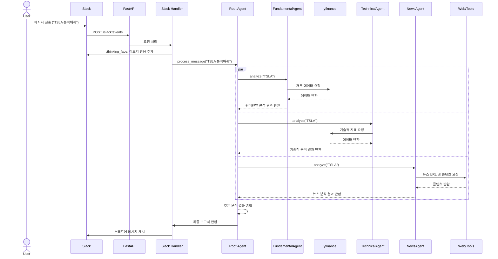

# Jelly Cow - AI 투자 분석 에이전트

Jelly Cow는 금융 자산 및 투자 포트폴리오에 대한 심층적인 분석 보고서를 제공하도록 설계된 AI 기반 투자 분석 에이전트입니다. 기본적 분석, 기술적 분석, 뉴스 분석을 수행하기 위해 전문화된 AI 에이전트로 구성된 계층적 팀을 사용하며, 종합된 보고서를 Slack을 통해 전달합니다.

## 주요 기능

- **Slack 연동**: Slack 워크스페이스 내에서 DM이나 멘션을 통해 에이전트와 직접 상호작용하여 개별 자산 분석 또는 포트폴리오 진단을 요청할 수 있습니다.
- **포트폴리오 리밸런싱 제안**: 사용자의 전체 포트폴리오를 분석하고, 각 자산의 비중을 늘리거나 줄여야 할지에 대한 실행 가능한 조언을 제공합니다. 이 과정에서 보유 현금을 고려하여 현실적인 리밸런싱 계획을 수립합니다.
- **계층적 에이전트 팀**: 루트 에이전트가 전문가 팀에게 작업을 위임하여 다각적인 분석을 수행합니다:
    - **기본적 분석가**: 기업 개요, 재무 비율(PER, PBR 등), 애널리스트 추천 의견 등 펀더멘털을 평가합니다.
    - **기술적 분석가**: RSI, MACD, 볼린저 밴드 등 주요 기술 지표를 바탕으로 차트를 분석합니다.
    - **뉴스 분석가**: 최신 뉴스를 수집하고 내용을 분석하여 시장 심리와 주요 이슈를 파악합니다.
- **확장 가능한 아키텍처**: 새로운 분석 도구나 데이터 소스(예: 한국투자증권 API 클라이언트 포함)를 쉽게 추가할 수 있습니다.
- **비동기 처리**: FastAPI와 asyncio로 구축되어 여러 요청을 효율적으로 처리합니다.

## 아키텍처

Jelly Cow는 사용자의 요청을 받아 여러 전문 에이전트가 협력하여 분석을 수행하고, 종합된 결과를 다시 사용자에게 전달하는 계층적 에이전트 아키텍처를 따릅니다. 전체적인 처리 흐름은 다음과 같습니다.



1.  **요청 수신**: 사용자가 Slack에서 메시지를 보내면, Slack API가 웹훅을 통해 FastAPI 서버(`app.py`)의 `/slack/events` 엔드포인트로 이벤트를 전송합니다.
2.  **이벤트 처리**: FastAPI는 요청을 Slack Bolt 핸들러(`apis/slack.py`)로 전달합니다. 핸들러는 요청을 확인했음을 알리기 위해 원본 메시지에 `:thinking_face:` 이모지를 추가합니다.
3.  **에이전트 오케스트레이션**: Slack 핸들러는 사용자의 쿼리를 `root_agent`에게 전달합니다. `root_agent`는 쿼리를 해석하고, `fundamental_analyzer`, `technical_analyzer`, `news_analyzer` 등 여러 하위 전문 에이전트에게 분석을 병렬로 위임합니다.
4.  **데이터 수집 및 분석**: 각 하위 에이전트는 `yfinance`나 웹 페이지 로딩과 같은 도구를 사용하여 필요한 데이터를 수집하고, 자신의 전문 분야에 맞춰 분석을 수행합니다.
5.  **결과 종합 및 응답**: `root_agent`는 하위 에이전트들로부터 받은 모든 분석 결과를 종합하여 최종 보고서를 생성합니다. 이 보고서는 Slack 핸들러를 통해 사용자가 처음 메시지를 보낸 스레드에 응답으로 게시됩니다.

## 시작하기

### 사전 요구 사항

- Python 3.12 이상
- Slack 워크스페이스
- Google Gemini API 키

#### 1. Slack 봇 생성 및 토큰 발급

1.  [Slack API](https://api.slack.com/apps) 페이지로 이동하여 **Create New App**을 클릭하고, **From scratch**를 선택합니다.
2.  앱 이름을 정하고, 앱을 추가할 워크스페이스를 선택합니다.
3.  **OAuth & Permissions** 메뉴로 이동하여 **Bot Token Scopes** 섹션에서 다음 권한을 추가합니다.
    - `app_mentions:read`: 봇이 멘션된 채널의 메시지를 읽습니다.
    - `chat:write`: 메시지를 보냅니다.
    - `im:history`: 봇과의 DM(다이렉트 메시지) 기록을 읽습니다.
    - `reactions:write`: 메시지에 이모지 반응을 추가합니다.
4.  페이지 상단에서 **Install to Workspace**를 클릭하여 앱을 설치하고, **Bot User OAuth Token** (`xoxb-...` 형식)을 복사합니다. 이 값이 `.env` 파일의 `SLACK_BOT_TOKEN`이 됩니다.
5.  **Basic Information** 메뉴로 이동하여 **App Credentials** 섹션의 **Signing Secret** 값을 복사합니다. 이 값이 `.env` 파일의 `SLACK_SIGNING_SECRET`이 됩니다.
6.  **Event Subscriptions** 메뉴에서 **Enable Events**를 활성화합니다.
    - **Request URL**에는 FastAPI 서버의 공개 주소와 `/slack/events` 경로를 입력해야 합니다. (로컬 테스트 시 `ngrok`과 같은 터널링 도구 필요)
    - **Subscribe to bot events** 섹션에서 `app_mention`과 `message.im` 이벤트를 추가하여 봇이 멘션되거나 DM을 받을 때 이벤트를 수신하도록 설정합니다.

#### 2. Gemini API 키 발급

1.  [Google AI Studio](https://aistudio.google.com/)로 이동하여 Google 계정으로 로그인합니다.
2.  **Get API key**를 클릭하고, 새 프로젝트 또는 기존 프로젝트에서 API 키를 생성합니다.
3.  생성된 API 키를 복사합니다. 이 값이 `.env` 파일의 `GEMINI_API_KEY`가 됩니다.

### 설치

1.  **리포지토리 클론:**
    ```bash
    git clone <repository-url>
    cd jelly_cow
    ```

2.  **의존성 설치:**
    ```bash
    pip install -r requirements.txt
    ```

3.  **환경 변수 설정:**
    - `.env_template` 파일을 `.env`라는 새 파일로 복사합니다.
    - 위에서 발급받은 `SLACK_BOT_TOKEN`, `SLACK_SIGNING_SECRET`, `GEMINI_API_KEY` 값을 입력합니다.

### 사용법

1.  **애플리케이션 실행:**
    ```bash
    python app.py
    ```
    FastAPI 서버가 `http://0.0.0.0:3000`에서 시작됩니다. (로컬에서 Slack 이벤트를 수신하려면 `ngrok http 3000`과 같은 명령어로 외부 인터넷에 노출해야 합니다.)

2.  **Slack에서 봇과 상호작용:**
    - **개별 자산 분석**: 분석하려는 주식이나 자산의 이름으로 봇에게 다이렉트 메시지를 보냅니다 (예: "Apple").
    - **포트폴리오 분석**: "내 포트폴리오 분석해줘" 와 같이 요청합니다.
    - 채널에서 봇을 멘션합니다 (예: "@JellyCow Tesla 분석해줘").

    봇은 :thinking_face: 이모티콘으로 요청을 확인하고 분석을 수행한 후 스레드에 최종 보고서를 게시합니다.
